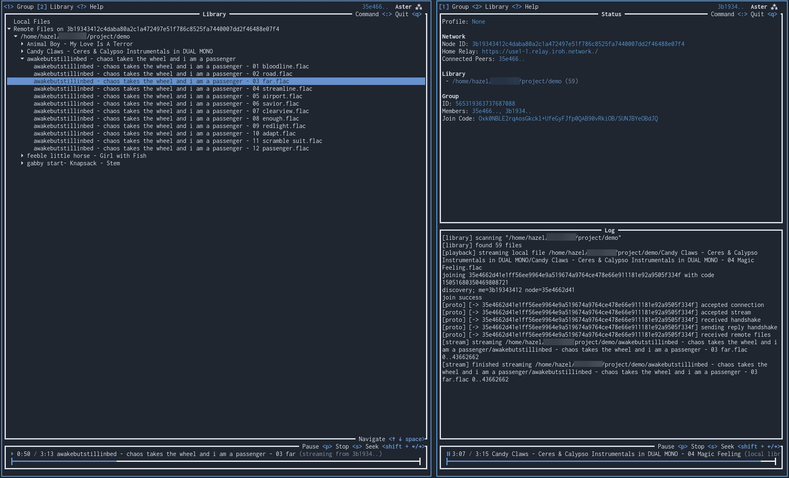

# Aster

Local-first peer-to-peer music streaming prototype.

## Usage

Running the application:
* Install the Rust toolchain from https://www.rust-lang.org/tools/install.
* Clone the repository.
* Run the application with `cargo run`.

Using the application:
* In another terminal, run a second instance of the application.
* Press `?` to view the built-in help.
* Press `1` and `2` to switch between the group management and library views.
* On the first instance, type `:creategroup` to initialize a new group.
* Copy the generated join code.
* On the second instance, type `:joingroup <join code>` to join the group.
* The instances will negotiate joining, connecting, and syncing. The first tab will show some log messages.
* On either instance, type `:addlibrary /path/to/library` with a path to a folder containing some audio files.
* Both instances will see the files in the library tab.
* Both instances will be able to play the files, either from local disk or streamed over the network.
* Audio playback can be controlled with `p` to pause, `s` to stop, and `shift + left/right` to seek.
* If run with a single argument (`cargo run -- alice`), state will be persisted to `./data` to test rejoining existing groups.

## Todo

Some quality-of-life things that are missing:

* Make log UI scrollable
* Display peer connection state (direct vs relayed)
* Fix potential bug with input handling on Windows
* Improve peer reconnection logic
